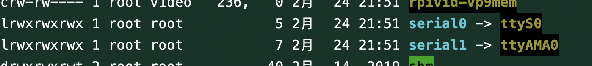

[toc]
# 串口调试
[参考1](https://blog.csdn.net/bat2fly/article/details/106443561)
[参考2](https://blog.csdn.net/bat2fly/article/details/105632003)
[minicom使用](https://blog.csdn.net/qq_38880380/article/details/77662637)
## PC <=> raspberry
MacOS:comtool
raspberry pi:minicom

关于串口：
>树莓派从大的方向来说一共出了3代，每一代的CPU外设基本相同，但内核不同，外设里面一共包含两个串口，一个称之为硬件串口（/dev/ttyAMA0），一个称之为mini串口（/dev/ttyS0）。硬件串口由硬件实现，有单独的波特率时钟源，性能高、可靠，mini串口性能低，功能也简单，并且没有波特率专用的时钟源而是由CPU内核时钟提供，因此mini串口有个致命的弱点是：波特率受到内核时钟的影响。内核若在智能调整功耗降低主频时，相应的这个mini串口的波特率便受到牵连了，虽然你可以固定内核的时钟频率，但这显然不符合低碳、节能的口号。在所有的树莓派板卡中都通过排针将一个串口引出来了，目前除了树莓派3代以外 ，引出的串口默认是CPU的那个硬件串口。而在树莓派3代中，由于板载蓝牙模块，因此这个硬件串口被默认分配给与蓝牙模块通信了，而把那个mini串口默认分配给了排针引出的GPIO Tx Rx。

>树莓派的串口默认为串口终端调试使用，如要正常使用串口则需要修改树莓派设置。关闭串口终端调试功能后则不能再通过串口登陆访问树莓派，只能通过ssh或者远程桌面连接树莓派后进行控制。

1. 需要修改 `raspi-config`中的`Interface Options`中的`Serial Port`，关闭`login shell to be acessible over Serial`，开启`serial port hardware to be enabled`
2. 在`/boot/config.txt`文件末尾添加`enable_uart=1`（我的已经有了）
3. `apt-get install minicom`
4. `sudo minicom -s`设置minicom
   serial port setup=>A:/dev/ttyS0 E:9600(似乎波特率低点比较稳定) FG:No=>save setup as dfl（保存为默认设置）
5. `sudo minicom -D /dev/ttyS0`
   `ctrl-a z`显示函数列表
   `e`显示收到信息与发送的信息
   `x`关闭并reset
   `q`关闭不reset

---以下将serial0对应到/dev/ttyAMA0---
>对应关系可以通过`ls -l /dev`查看

6. `/boot/config.txt`最后添加`dtoverlay=disable-bt`
7. `sudo systemctl disable hciuart`
8. 重启即可。
9. 之后应将minicom设置为serial port setup=>A:/dev/ttyAMA0 E:9600(似乎波特率低点比较稳定) FG:No=>save setup as dfl（保存为默认设置）
10. 注意树莓派的RxTx应连接usb转ttl的TxRx。

代码编写
[STM32与树莓派串口透传](https://blog.csdn.net/m0_38106923/article/details/84330186)
