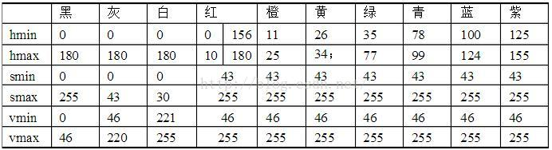

### 连接摄像头
- `lsusb` 查看摄像头有关信息
- `ls /dev/video*` 查看摄像头设备名
>for my raspberry pi the CSI camera is /dev/video0 and the USB camera is /dev/video1
- 可以使用fswebcam软件使用摄像头，具体见[树莓派上用 fswebcam + USB 摄像头拍摄](https://shumeipai.nxez.com/2020/08/23/raspberry-pi-fswebcam.html)

opencv调用摄像头
`camera = cv2.VideoCapture(0)` 0为CSI摄像头，1为USB摄像头

[利用opencv调整摄像头参数](https://blog.csdn.net/leon_zeng0/article/details/102791988)
### HSV各颜色区间
