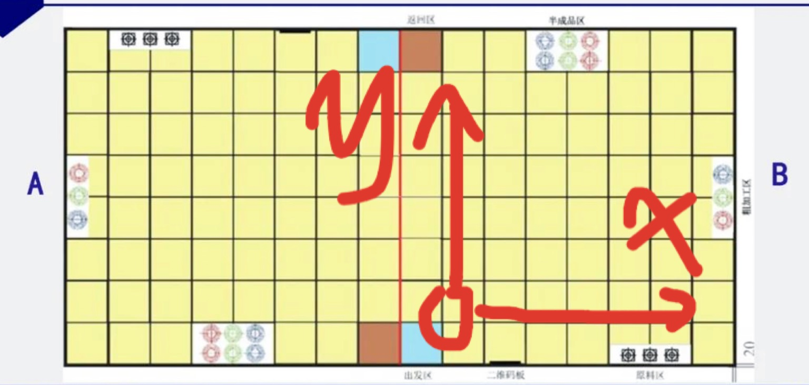

移动到二维码显示板前读取二维码 => 屏幕上显示 => 将物料从原料区（识别物料在原料区摆放顺序）搬运（一次最多带三个）到粗加工区（按照色环给分） => 粗加工区搬运至半成品区（台阶色环或码垛） => 回到出发区（信息码需显示至结束）

（xy坐标如图所示，每一个格代表1）具体过程：1. 车从出发区到中心位于(0, 0)。2. 沿直线到达(5, 0)（中途会进行拍照读取二维码）3. 拍照获取原料摆放顺序。4. 将上层三个圆柱__按顺序__搬上车。 5. 到达（6， 3）（循线或走斜线）。5. 按任务码__顺序__放置三个物料。6. 返回（5，0）并将货架下层三个圆柱__按顺序__搬上车。7. 到达（6，3）按照任务码__顺序__放置三个物料。并将上层物料搬上车（不清楚是否需要顺序）。8. 到达（3，5）或（3，6）或中间某处。并将物料放置在对应颜色色环上。（先放台阶上还是台阶下无所谓）9. 返回（6，3）搬运下层物块。10. 到达（3，5？）按码垛或者色环放置。10.返回出发点。